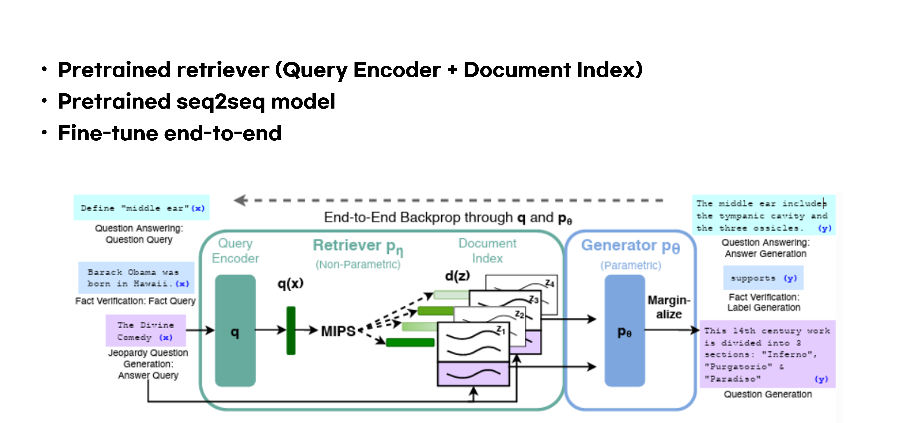

# RAG Seminar

This repository contains the slides for a research seminar on **Retrieval-Augmented Generation (RAG)**.

The seminar was presented at the **Machine Learning & Bioinformatics Lab, Pusan National University (PNU)** in 2026.

  

## Presenter

**Jiwon Lee**  
M.S. Student  
Machine Learning & Bioinformatics Lab  
Pusan National University

## Lab

Machine Learning & Bioinformatics Lab  
Pusan National University  

🔗 https://dmb.pusan.ac.kr/dmb/index.do

## Slides

📄 [View Slides](rag_seminar_slides.pdf)

## Description

This seminar introduces the fundamental concepts and recent developments in **Retrieval-Augmented Generation (RAG)**, a framework that integrates large language models with external knowledge retrieval systems to improve factual accuracy and domain adaptability.

## Contact

If you find any errors or have questions regarding the material, please feel free to contact:
📧 jiwon_lee@pusan.ac.kr
